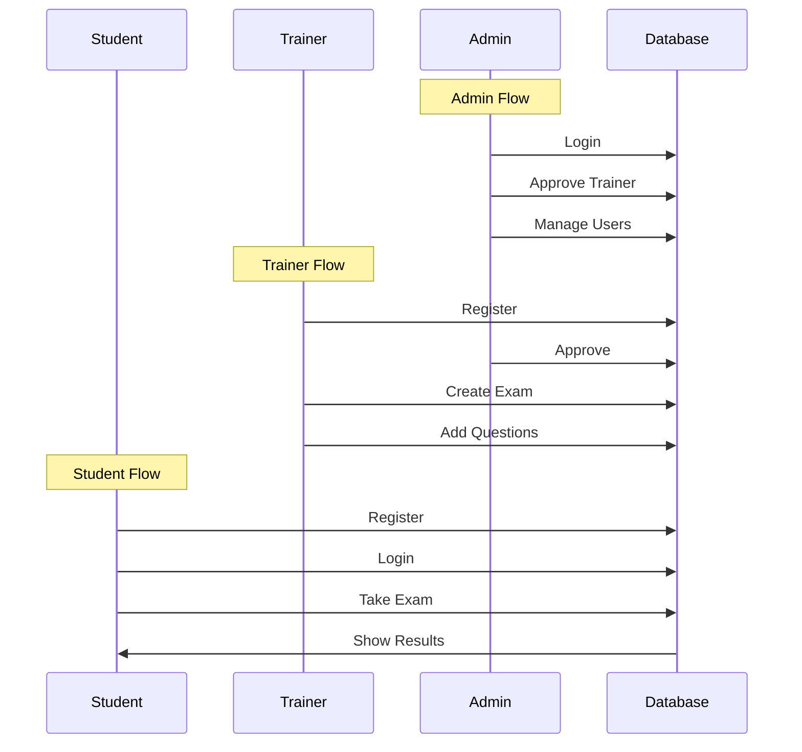

<div align=\"center\">

# 📝 Exam Portal


---

### 🎓 A Complete Online Examination System with Multi-Role Authentication

*Empowering Education Through Digital Assessment*

[](https://github.com/Chaitanya-Rasal/Exam_Portal/stargazers)
[](https://github.com/Chaitanya-Rasal/Exam_Portal/network/members)


</div>

---

## 📋 Table of Contents

- [About The Project](#-about-the-project)
- [Key Features](#-key-features)
- [User Roles](#-user-roles)
- [Technology Stack](#-technology-stack)
- [Project Structure](#-project-structure)
- [Screenshots](#-screenshots)
- [Getting Started](#-getting-started)
- [Database Schema](#-database-schema)
- [API Flow](#-api-flow)
- [Future Enhancements](#-future-enhancements)
- [Contributing](#-contributing)
- [Author](#-author)

---

## 🎯 About The Project

**Exam Portal** is a comprehensive web-based examination system designed to streamline the process of conducting online assessments. Built using Java Server Pages (JSP) and Servlets, this platform provides a robust solution for educational institutions, training centers, and organizations to manage examinations digitally.

> 💡 **Vision**: To provide a seamless, secure, and efficient platform for conducting online examinations with role-based access control.

### Why Exam Portal?

- ✅ **Multi-Role System** - Separate dashboards for Admin, Trainer, and Students
- ✅ **Secure Authentication** - Role-based login with session management
- ✅ **Exam Management** - Create, manage, and conduct exams effortlessly
- ✅ **Question Bank** - Add and organize questions by category
- ✅ **Instant Results** - Automatic evaluation and result generation
- ✅ **User Management** - Complete CRUD operations for all user types

---

## ✨ Key Features

<table>
<tr>
<td width=\"50%\">

### 👨‍💼 Admin Features
- Dashboard with system overview
- Approve/Revoke trainer registrations
- Manage all users (Students & Trainers)
- View comprehensive reports
- System configuration

</td>
<td width=\"50%\">

### 👨‍🏫 Trainer Features
- Personal dashboard
- Create and manage exams
- Add questions to question bank
- Monitor student performance
- View exam results

</td>
</tr>
<tr>
<td width=\"50%\">

### 👨‍🎓 Student Features
- User-friendly dashboard
- Browse available exams
- Take online examinations
- Real-time exam interface
- View results and history

</td>
<td width=\"50%\">

### 🔒 Security Features
- Session-based authentication
- Role-based access control
- Secure login/logout
- Input validation
- Protected routes

</td>
</tr>
</table>

---

## 👥 User Roles

```
┌─────────────────────────────────────────────────────────────┐
│                      EXAM PORTAL                            │
├─────────────────┬─────────────────┬─────────────────────────┤
│      ADMIN      │     TRAINER     │        STUDENT          │
├─────────────────┼─────────────────┼─────────────────────────┤
│ • Full Control  │ • Create Exams  │ • Take Exams            │
│ • User Mgmt     │ • Add Questions │ • View Results          │
│ • Approve Users │ • View Results  │ • Profile Management    │
│ • System Config │ • Manage Q-Bank │ • Exam History          │
└─────────────────┴─────────────────┴─────────────────────────┘
```

### Role Hierarchy

| Role | Access Level | Capabilities |
|------|-------------|--------------|
| **Admin** | Full Access | System-wide control, user management, trainer approval |
| **Trainer** | Moderate | Exam creation, question management, result viewing |
| **Student** | Limited | Exam participation, result viewing, profile management |

---

## 🛠 Technology Stack

<table>
<tr>
<td align=\"center\" width=\"140\">

<br/><b>Java</b>
<br/><sub>Backend Logic</sub>
</td>
<td align=\"center\" width=\"140\">

<br/><b>JSP/Servlets</b>
<br/><sub>Web Layer</sub>
</td>
<td align=\"center\" width=\"140\">

<br/><b>HTML5</b>
<br/><sub>Structure</sub>
</td>
<td align=\"center\" width=\"140\">

<br/><b>CSS3</b>
<br/><sub>Styling</sub>
</td>
<td align=\"center\" width=\"140\">

<br/><b>MySQL</b>
<br/><sub>Database</sub>
</td>
</tr>
</table>

| Layer | Technology | Purpose |
|-------|------------|---------|
| **Frontend** | HTML, CSS, JavaScript | User Interface |
| **Backend** | Java, JSP, Servlets | Business Logic |
| **Server** | Apache Tomcat 9.x | Application Server |
| **Database** | MySQL 8.x | Data Storage |
| **IDE** | Eclipse/IntelliJ IDEA | Development |

---

## 📁 Project Structure

```
Exam_Portal/
│
├── 📂 .idea/                    # IntelliJ IDEA configuration
├── 📂 .settings/                # Eclipse settings
│
├── 📂 src/
│   └── 📂 main/
│       └── 📂 webapp/           # Web application root
│           │
│           ├── 📂 META-INF/     # Application metadata
│           │
│           ├── 🏠 index.html              # Landing page
│           │
│           ├── 🔐 AUTHENTICATION
│           │   ├── AdminLogin.jsp         # Admin login page
│           │   ├── TrainerLogin.jsp       # Trainer login page
│           │   ├── StudentLogin.jsp       # Student login page
│           │   ├── LoginProcess.jsp       # Login handler
│           │   └── Logout.jsp             # Session termination
│           │
│           ├── 📝 REGISTRATION
│           │   ├── StudentRegistration.jsp    # Student signup
│           │   └── TrainerRegistration.jsp    # Trainer signup
│           │
│           ├── 📊 DASHBOARDS
│           │   ├── AdminDashboard.jsp     # Admin control panel
│           │   ├── TrainerDashboard.jsp   # Trainer workspace
│           │   └── StudentDashboard.jsp   # Student portal
│           │
│           ├── 👨‍💼 ADMIN OPERATIONS
│           │   ├── ApproveTrainer.jsp     # Trainer approval
│           │   ├── RevokeTrainer.jsp      # Revoke trainer access
│           │   ├── DeleteStudent.jsp      # Remove student
│           │   ├── DeleteTrainer.jsp      # Remove trainer
│           │   ├── EditStudent.jsp        # Modify student info
│           │   └── UpdateStudentProcess.jsp   # Update handler
│           │
│           ├── 📝 EXAM MANAGEMENT
│           │   ├── CreateExamProcess.jsp      # Create new exam
│           │   ├── AddQuestions.jsp           # Add questions
│           │   ├── SaveQuestionProcess.jsp    # Save questions
│           │   ├── StudentExamInterface.jsp   # Exam taking UI
│           │   └── SubmitExam.jsp             # Exam submission
│           │
│           └── 📈 RESULTS
│               └── ViewResults.jsp        # Results display
│
├── 📄 .classpath                # Java classpath config
├── 📄 .project                  # Eclipse project config
├── 📄 Exam_Portal.iml           # IntelliJ module file
└── 📄 README.md                 # Project documentation
```

---

## 🖼 Screenshots

<details>
<summary><b>Click to view application screenshots</b></summary>

### Landing Page
> The main entry point with role selection

### Admin Dashboard
> Complete control panel for system administrators

### Trainer Dashboard  
> Exam creation and management interface

### Student Dashboard
> Available exams and results overview

### Exam Interface
> Clean, focused examination environment

</details>

---

## 🚀 Getting Started

### Prerequisites

Before you begin, ensure you have the following installed:

```bash
# Java Development Kit (JDK 8 or higher)
java -version
# Expected: java version \"1.8.x\" or higher

# Apache Tomcat 9.x
# Download from: https://tomcat.apache.org/download-90.cgi

# MySQL Server 8.x
mysql --version
# Expected: mysql Ver 8.x.x

# IDE (Eclipse EE or IntelliJ IDEA Ultimate)
```

### Installation Steps

#### 1️⃣ Clone the Repository

```bash
git clone https://github.com/Chaitanya-Rasal/Exam_Portal.git
cd Exam_Portal
```

#### 2️⃣ Database Setup

```sql
-- Create Database
CREATE DATABASE exam_portal;
USE exam_portal;

-- Create Users Table
CREATE TABLE users (
    id INT PRIMARY KEY AUTO_INCREMENT,
    username VARCHAR(50) UNIQUE NOT NULL,
    password VARCHAR(255) NOT NULL,
    email VARCHAR(100) UNIQUE NOT NULL,
    role ENUM('ADMIN', 'TRAINER', 'STUDENT') NOT NULL,
    status ENUM('ACTIVE', 'PENDING', 'REVOKED') DEFAULT 'PENDING',
    created_at TIMESTAMP DEFAULT CURRENT_TIMESTAMP
);

-- Create Exams Table
CREATE TABLE exams (
    id INT PRIMARY KEY AUTO_INCREMENT,
    title VARCHAR(200) NOT NULL,
    description TEXT,
    duration INT NOT NULL,
    trainer_id INT,
    created_at TIMESTAMP DEFAULT CURRENT_TIMESTAMP,
    FOREIGN KEY (trainer_id) REFERENCES users(id)
);

-- Create Questions Table
CREATE TABLE questions (
    id INT PRIMARY KEY AUTO_INCREMENT,
    exam_id INT NOT NULL,
    question_text TEXT NOT NULL,
    option_a VARCHAR(255),
    option_b VARCHAR(255),
    option_c VARCHAR(255),
    option_d VARCHAR(255),
    correct_answer CHAR(1),
    FOREIGN KEY (exam_id) REFERENCES exams(id)
);

-- Create Results Table
CREATE TABLE results (
    id INT PRIMARY KEY AUTO_INCREMENT,
    student_id INT NOT NULL,
    exam_id INT NOT NULL,
    score INT,
    submitted_at TIMESTAMP DEFAULT CURRENT_TIMESTAMP,
    FOREIGN KEY (student_id) REFERENCES users(id),
    FOREIGN KEY (exam_id) REFERENCES exams(id)
);

-- Insert Default Admin
INSERT INTO users (username, password, email, role, status) 
VALUES ('admin', 'admin123', 'admin@examportal.com', 'ADMIN', 'ACTIVE');
```

#### 3️⃣ Configure Database Connection

Update the database connection settings in your JSP files:

```java
// Database Configuration
String dbURL = \"jdbc:mysql://localhost:3306/exam_portal\";
String dbUser = \"root\";
String dbPassword = \"your_password\";
```

#### 4️⃣ Deploy to Tomcat

**Option A: Using IDE**
1. Import project into Eclipse/IntelliJ
2. Configure Tomcat server
3. Add project to server
4. Start server

**Option B: Manual Deployment**
```bash
# Copy project to Tomcat webapps
cp -r Exam_Portal /path/to/tomcat/webapps/

# Start Tomcat
cd /path/to/tomcat/bin
./startup.sh    # Linux/Mac
startup.bat     # Windows
```

#### 5️⃣ Access the Application

```
🌐 URL: http://localhost:8080/Exam_Portal

👨‍💼 Admin Login:
   Username: admin
   Password: admin123
```

---

## 📊 Database Schema

```
┌──────────────┐     ┌──────────────┐     ┌──────────────┐
│    USERS     │     │    EXAMS     │     │  QUESTIONS   │
├──────────────┤     ├──────────────┤     ├──────────────┤
│ id (PK)      │────<│ trainer_id   │     │ id (PK)      │
│ username     │     │ id (PK)      │────<│ exam_id (FK) │
│ password     │     │ title        │     │ question_text│
│ email        │     │ description  │     │ option_a     │
│ role         │     │ duration     │     │ option_b     │
│ status       │     │ created_at   │     │ option_c     │
│ created_at   │     └──────────────┘     │ option_d     │
└──────────────┘                          │ correct_ans  │
       │                                  └──────────────┘
       │
       │         ┌──────────────┐
       └────────>│   RESULTS    │
                 ├──────────────┤
                 │ id (PK)      │
                 │ student_id   │
                 │ exam_id (FK) │
                 │ score        │
                 │ submitted_at │
                 └──────────────┘
```

---

## 🔄 API Flow



### User Flow Diagram

```
┌─────────┐     ┌─────────────┐     ┌──────────────┐     ┌─────────────┐
│  INDEX  │────>│    LOGIN    │────>│  DASHBOARD   │────>│  FEATURES   │
│  .html  │     │    .jsp     │     │    .jsp      │     │    .jsp     │
└─────────┘     └─────────────┘     └──────────────┘     └─────────────┘
                      │                    │
                      ▼                    ▼
               ┌─────────────┐     ┌──────────────┐
               │  REGISTER   │     │   LOGOUT     │
               │    .jsp     │     │    .jsp      │
               └─────────────┘     └──────────────┘
```

---

## 🔮 Future Enhancements

- [ ] **Timer Implementation** - Countdown timer for exams
- [ ] **Question Randomization** - Shuffle questions for each attempt
- [ ] **Analytics Dashboard** - Performance metrics and insights
- [ ] **Email Notifications** - Registration and result alerts
- [ ] **PDF Report Generation** - Downloadable result certificates
- [ ] **Multi-language Support** - Internationalization
- [ ] **Mobile Responsive Design** - Enhanced mobile experience
- [ ] **Bulk Question Upload** - CSV/Excel import feature
- [ ] **Proctoring Features** - Anti-cheating measures
- [ ] **API Integration** - REST API for mobile apps

---

## 🤝 Contributing

Contributions are what make the open source community amazing! Any contributions you make are **greatly appreciated**.

1. **Fork** the Project
2. **Create** your Feature Branch
   ```bash
   git checkout -b feature/AmazingFeature
   ```
3. **Commit** your Changes
   ```bash
   git commit -m 'Add some AmazingFeature'
   ```
4. **Push** to the Branch
   ```bash
   git push origin feature/AmazingFeature
   ```
5. **Open** a Pull Request

### Contribution Guidelines

- Follow Java naming conventions
- Add comments for complex logic
- Update documentation for new features
- Write clean, maintainable code

---

## 📝 License

Distributed under the MIT License. See `LICENSE` for more information.

---

## 📬 Author

<div align=\"center\">

**Chaitanya Rasal**

[](https://github.com/Chaitanya-Rasal)

</div>

---

## 🙏 Acknowledgments

- Java Servlet API Documentation
- Apache Tomcat Documentation
- MySQL Documentation
- Open Source Community

---

<div align=\"center\">

### ⭐ If this project helped you, please consider giving it a star!

---

<table>
<tr>
<td align=\"center\">
<b>Built with</b><br/>


</td>
</tr>
</table>

*Happy Coding! 🚀*

---

<sub>Made with ❤️ by Chaitanya Rasal</sub>

</div>
